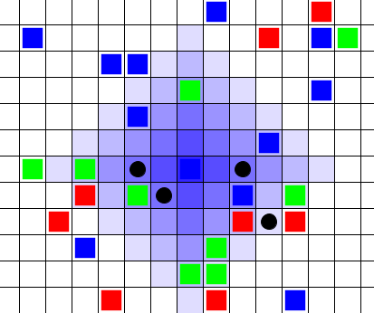
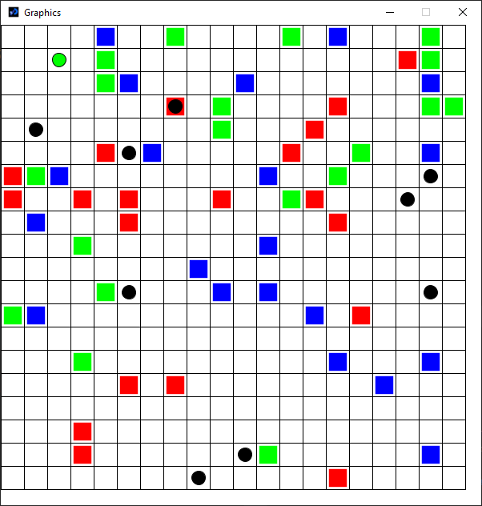
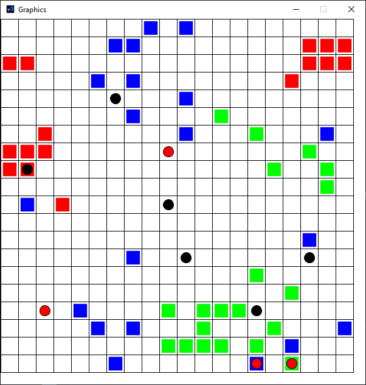

# Rapport du TP 2 de SMA Version 2

L’ensemble des classes utilisées dans notre programme se trouve dans *src/com/company*.

 
Pour encoder efficacement le problème, nous avons utilisé plusieurs classes.

La première classe est la classe **Simulation** qui sert comme son nom l’indique à gérer la simulation. Elle contient ainsi des fonctions permettant d’initialiser l’environnement et les agents qui le constituent et peut lancer des étapes de simulation qui représentent le tour d’un agent.

La classe **Environment** est chargée de regrouper les informations relatives à l’environnement. Elle contient en particulier un tableau 2D de "Cubes" (la classe représentant un object).

Finalement, on dispose évidemment d’une classe **Agent** qui représente un agent en particulier. Cet agent est constitué de son identifiant, d’une instance de la classe **Perception** et d'une instance de la classe **Memory**.

Cette classe **Perception** encapsule la perception de l’agent. L'agent perçoit deux objets : celui posé sur la case de l'agent et celui que l'agent porte. Cette classe est la seule à être mise à jour directement depuis l’extérieur pour simuler le fait que l’agent s’informe sur son environnement à l’aide de ses capteurs.
Les paramètres de l'algorithme de cognition sont déclarés en tant que constante en haut de la clase **Agent**. Les paramètres de l'environnement sont déclarés en tant que constante en haut de la classe **Environnement**.

Dans cette version, on ajoute un troisième type d'objet noté **C** qui correspond à un objet nécéssitant 2 agents pour être déplacé.
Dans le programme, cela se traduit par un agent qui va venir se superposer à un autre et qui se mettra en mode
suivi de l'autre agent. Il n'aura alors plus de tour de réflexion et ne fera que suivre l'autre agent tant qu'il n'aura pas
posé son bloc.

Pour ajouter un comportement collaboratif, on va également ajouter un système de phéromones.
Lorsqu'un agent rencontre un objet de type **C**, il va émettre un nuage de phéromones sur un rayon de 5 cases.
Ces phéromones vont attirer les agents à proximité qui viendront aider le premier agent à porter l'objet. Au fur et à mesure,
les phéromones vont diminuer en intensité jusqu'à complètement disparaître.

Pour mieux visualiser le comportement des agents, on dispose d'une visualisation graphique de la simulation,
obtenue à l'aide de la librairie *Processing*.

Dans l'image ci-dessous, on peut voir à quoi ressemble une émission de phéromones, ainsi que leur intensité (qui diminue
en fonction de la distance par rapport au point d'émission original).

# Résultat

**Avant**

**Après**

